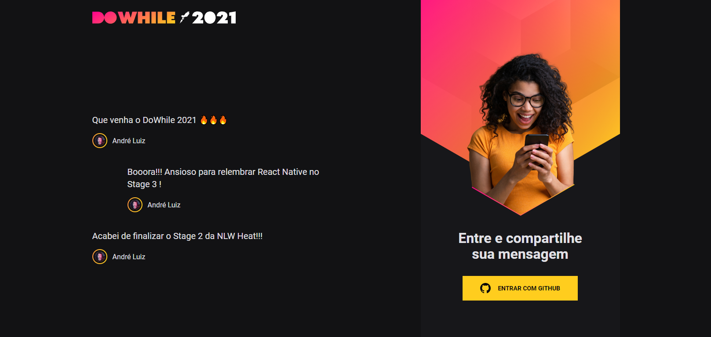
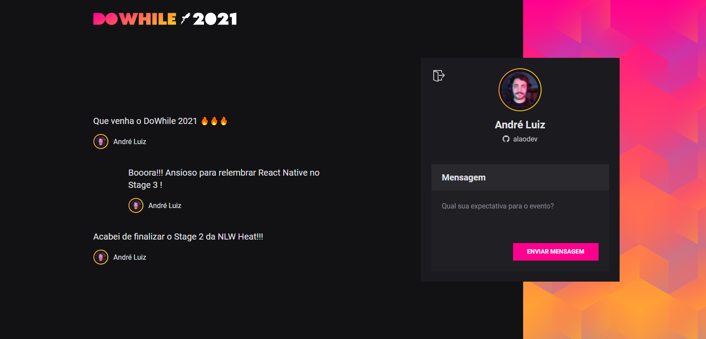

# NLW Heat React


<br/>


<br/>
<br/>

> Project developed at the Next Level Week Heat event held by Rocketseat. This project aims to build the backend of a commenting application. Applied technologies: ReactJS, TypeScript, Vite and CSS modules.

<br/>

## Applied technologies

<code></code>
<code></code>
<code></code>
<code></code>
<code></code>

<br/>

## Requirements

Before starting, make sure you have met the following requirements:
* Node version 14.17.6 or greater;
* Yarn or NPM;
* Git.

<br/>

## How to Run

To run the project, follow these steps:

Go to the directory where you want to clone the project and run:
```
git clone https://github.com/alaodev/nlw-heat-react.git
```

Then: 
```
cd nlw-heat-react
```

Now:
```
yarn or npm i // To install de dependencies.
```

Finally, execute:
```
yarn dev or npm run dev
```

Make sure the project backend is running.

## Aplication Preview

* Authenticate Screen



<br/>

* Comment Screen




[⬆ Back to the top](#nlw_heat_node)<br>